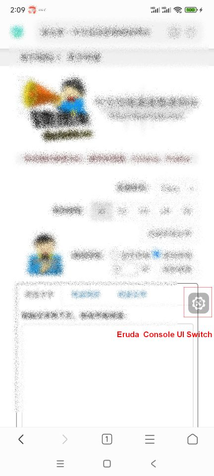
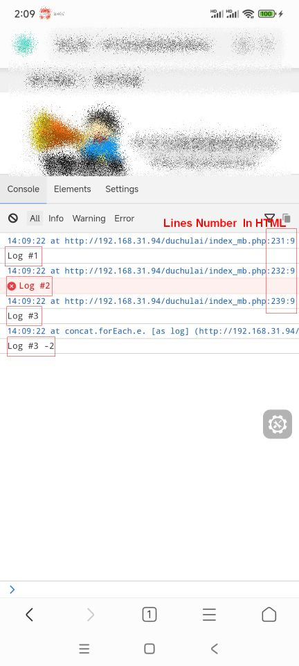

# A Basic Tutorial

## How To Show Eruda Console UI In Mobile Browser

1. Get Eruda JavaScript Library from NPM:
`npm i eruda`

2. Include Eruda into your project:
```JavaScript
<script src="node_modules/eruda/eruda.js"></script>
```

3. Initialize Eruda in your code:
```JavaScript
// The following code is for demonstration

let el = document.createElement('div');
document.body.appendChild(el);

eruda.init({
    container: el,
    tool: ['console', 'elements']
});

let console = eruda.get('console');
console.config.set('catchGlobalErr', true);
console.config.set('displayExtraInfo', true);

console.log('Log #1');
console.error(new Error('Log #2'));
console.on('log', function (msg) 
{
    console.info(msg, "-2");
});
console.log("Log #3");
```

4. Enable Eruda in visiting Url:
`http://example.com/?eruda=true`

5. Switch on Eruda UI in Browser:


6. Console logs examples:

